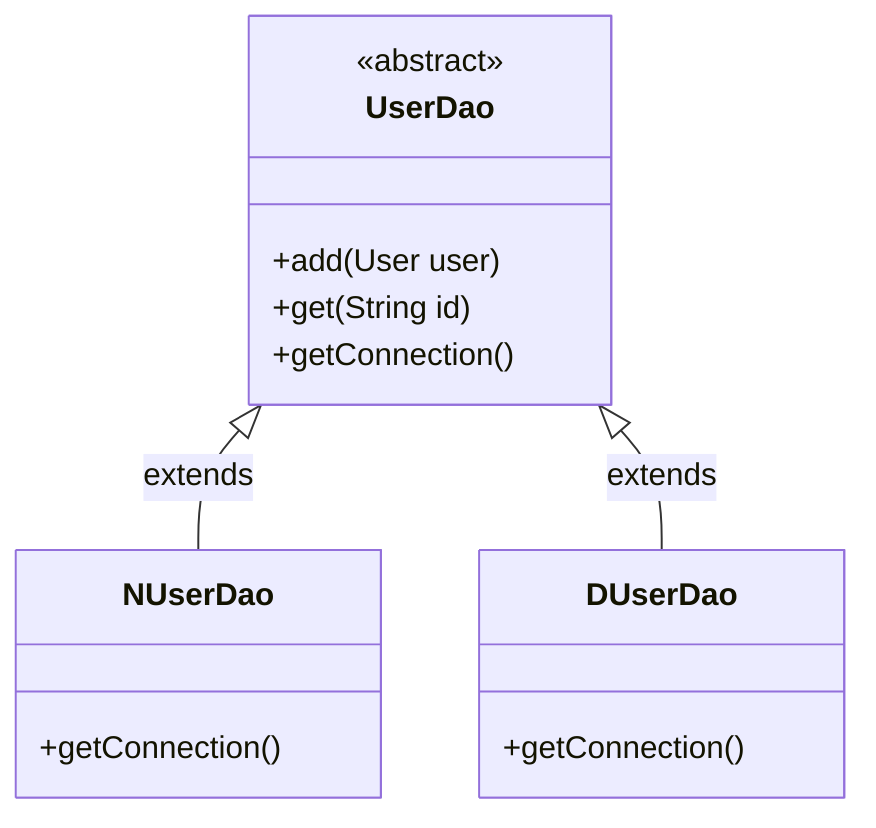
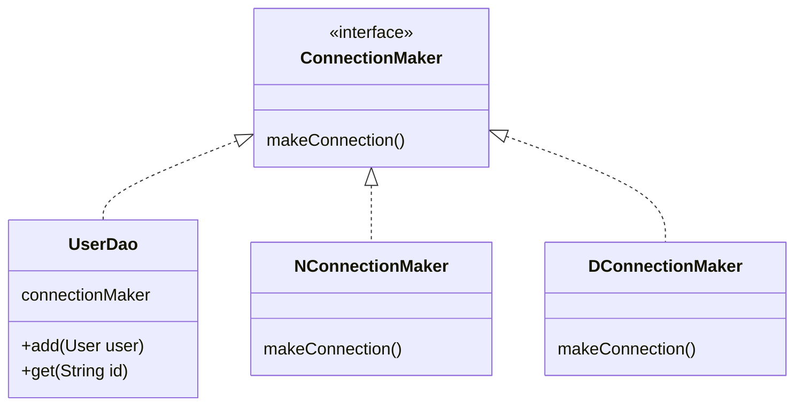

### 템플릿 메소드 패턴(template method pattern)

```mermaid
classDiagram
    class UserDao {
        <<abstract>>
        +add(User user)
        +get(String id)
        +getConnection()
    }
    class NUserDao {
        +getConnection()
    }
    class DUserDao {
        +getConnection()
    }

    UserDao <|-- NUserDao: extends
    UserDao <|-- DUserDao: extends
```

### 인터페이스 도입

```mermaid
classDiagram
    
    class UserDao {
        connectionMaker
        +add(User user)
        +get(String id)
    }
    class ConnectionMaker {
        <<interface>>
        makeConnection()
    }
    
    class NConnectionMaker {
        makeConnection()
    }
    class DConnectionMaker {
        makeConnection()
    }

    ConnectionMaker <|.. UserDao
    ConnectionMaker <|.. NConnectionMaker
    ConnectionMaker <|.. DConnectionMaker

```
