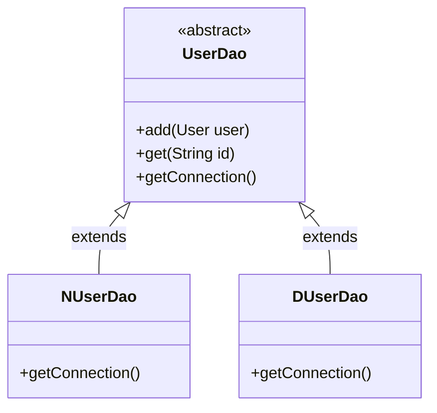

### 템플릿 메소드 패턴(template method pattern)

```mermaid
classDiagram
    class UserDao {
        <<abstract>>
        +add(User user)
        +get(String id)
        +getConnection()
    }
    class NUserDao {
        +getConnection()
    }
    class DUserDao {
        +getConnection()
    }

    UserDao <|-- NUserDao: extends
    UserDao <|-- DUserDao: extends
```
