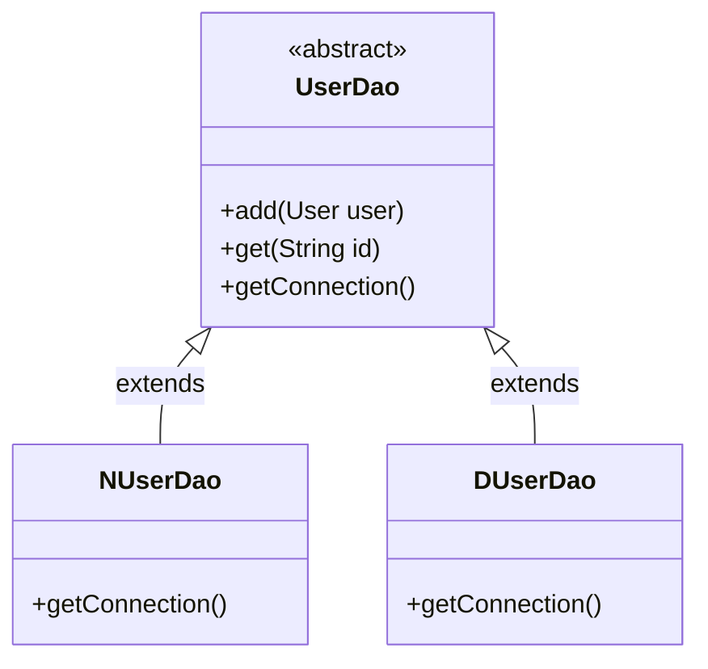
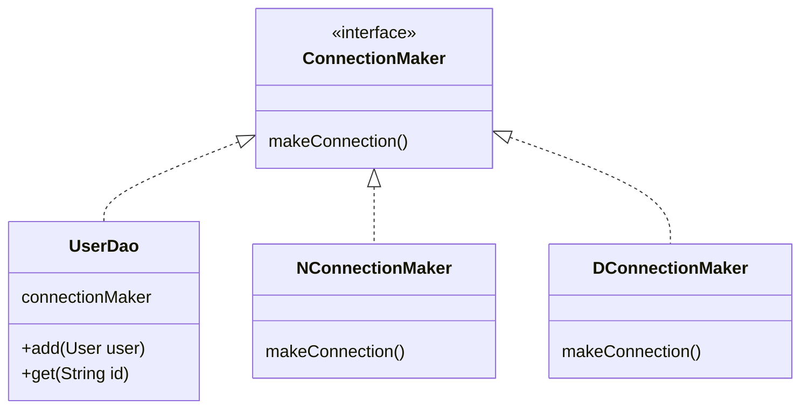
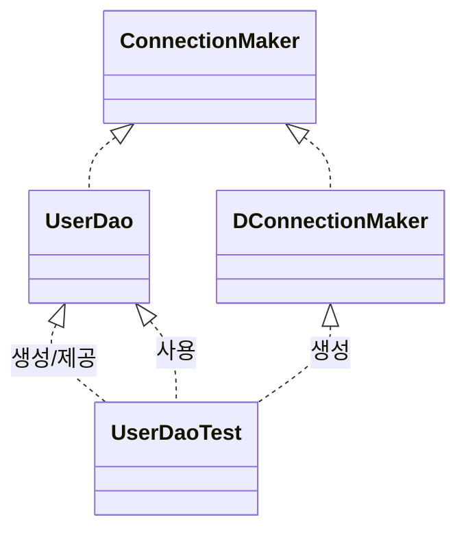
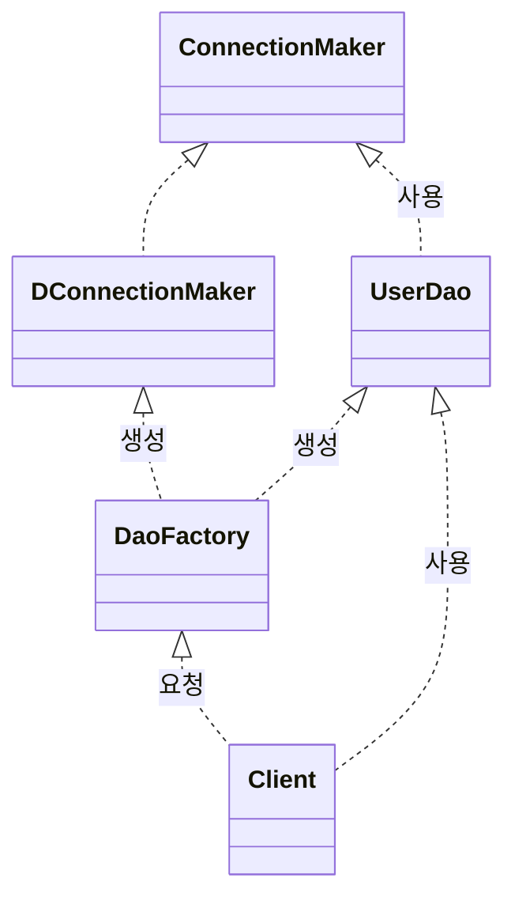
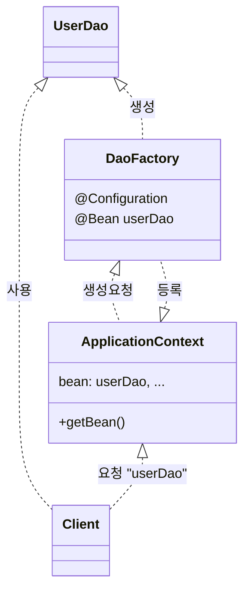
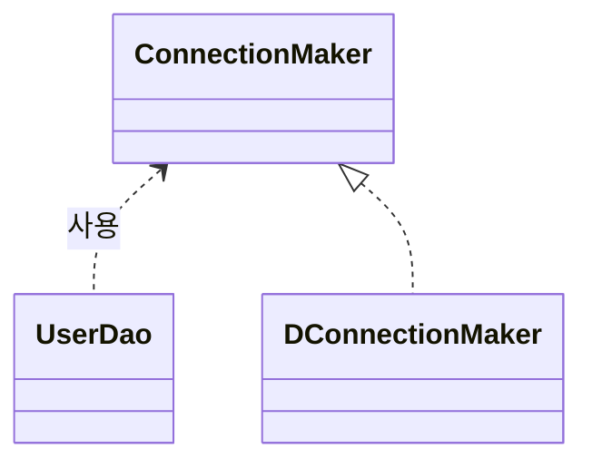
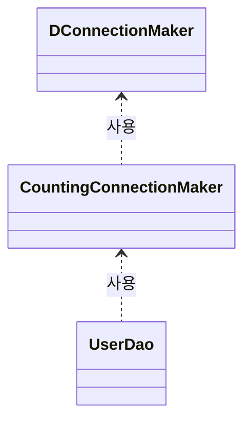

### 템플릿 메소드 패턴(template method pattern)

### 인터페이스 도입

### 관계 설정과 책임 p83.

- 개방 폐쇄 원칙, Open-closed Principle
- 전략 패턴

### 팩토리 도입

### 애플리케이션 컨텍스트 도입

### 의존 관계

### 부가 기능 추가

### TDD: 선 테스트 작성 후 기능 구현
- 복잡도가 낮은, 테스트 가능한 코드로 구현 가능
- 쉽게 발견하기 어려운 엣지(Edge)케이스를 놓치지 않게 해준다.
- 구현에 대한 빠른 피드백을 받을 수 있다.
- 과감한 리팩토링이 가능해진다.

